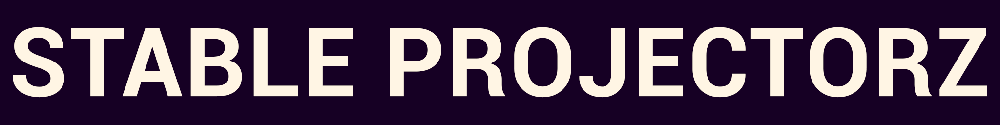

<h1 align="center">StableProjectorz: A free tool for making 3D and textures via StableDiffusion</h1>

<p align="center">
  
</p>

**StableProjectorz** is a tool for texturing 3D models using StableDiffusion.<br>
It also supports generating 3D models from 2D images.<br>

Official page: [StableProjectorz](https://stableprojectorz.com/) <br>
Our Discord server: [here](https://discord.gg/aWbnX2qan2)

<p align="center">
  
</p>

## 🛠️ Setup & Building
*   **Requirements:** Unity 6000.
*   **Codebase:** Located entirely in `Assets/_gm`.
*   **Build:** Press `Ctrl + Shift + B` -> **Build and Run**.
*   **Note:** Keep "Development Build" unchecked for performance.

## 📝 Contribution Rules
1.  **Nested Prefabs:** Keep UI separated in Prefabs. Don't modify prefabs externally. Save your work directly inside a deepest prefab itself, to prevent merge conflicts.
2.  **Communication:** Prefer singleton-pattern, to talk between scripts. For example  `MyCoolScript.instance`; Avoid drag-and-drop references. Initialize Singletons in `Awake()`.
3.  **Folders:** keep prefabs, scenes, scripts inside subfolders of `Features`. Do not use separate `Prefabs`, `Scenes`, `Scripts` folders.
4.  **Memory:** If you spawned a `RenderTexture` make sure to release it, to aviod memory leaks.
5.  **Variables:** Use `[SerializeField] private` instead of `public`.
6.  **Naming:** `_underscoreForMemberVariables`.

---

Watch the video about the codebase (as of Jan 2026) for a quick-start:

<div align="center">
  <a href="https://www.youtube.com/watch?v=uzz3KtbvIEk">
    
  </a>
</div>

## 📂 1. Architecture & Patterns
*   **Scene Management:** We use **Additive Loading**. `Start_Scene_Global` scene loads UI and manager-scenes separately to prevent merge conflicts.
*   **Update Loop:** `Update_callbacks_MGR` dispatches events (Navigation, Depth, Rendering) in a strict order. Using `Update()` for other things.
*   **Workflow:** Use **Nested Prefabs**. Avoid editing Scene files directly; edit the Prefab to keep Git diffs clean.

## 🧊 2. The 3D World
*   **Access:** `ModelsHandler_3D.instance` is the singleton entry point for all 3D data.
*   **Structure:**
    *   `Objs3D_Container`: Maps every sub-mesh to a unique ID for later retrieval.
    *   `UDIMs_Helper`: Scans UVs to detect tiles (1001, 1002, etc.).
*   **Importer:** `ModelsHandler3D_ImportHelper` uses **AssimpNet** to load OBJ/FBX/GLB at runtime.

## 🎥 3. The Camera System
Managed by `UserCameras_MGR`. Culling Planes are fixed (0.25–1000) for float precision.<br>
*   **View Camera**: Renders high-res image for user to see. Also renders a viewport depth texture, for mesh-clicking, etc.
*   **Depth Camera:** Renders black and white image to send to StableDiffusion (not an exact viewport depth).
*   **Content Camera:** Renders the square resolution to send to StableDiffusion (e.g., 512x512).
*   **Normals Camera:** Renders View-Space normals to send to StableDiffusion (Red=Right, Green=Up).
*   **Vertex-Colors Camera:** Renders Colors encoded in mesh-vertexes to send to StableDiffusion.
*   **Multi-View Logic:** We use **Perspective Shift** (via UI Pins) to arrange multiple cameras in one viewport.

## 🎨 4. Rendering Pipeline
*   **ProjectorCamera:** Spawns at the user's viewpoint. "Shines" the AI image inside the `_accumulation_uv_RT` texture.
*   **Target:** `Objects_Renderer_MGR` renders into `_accumulation_uv_RT`.
*   **Texture Arrays:** The target is a **RenderUDIMs** object (Texture Array). Each slice represents one UDIM tile.
*   **The Loop:** Clear Black → Bake Projections (respecting depth) → Dilate (Anti-Seam) → Display on Mesh.

## 🧠 5. AI Integration
*   **Pipeline:** `StableDiffusion_Hub` → `SD_Generate_PayloadMaker` → `SD_Generate_NetworkSender` (Talks to A1111/Forge via JSON).
*   **Storage:** `GenData2D_Archive` stores **Information Objects**, not loose files.
    *   **`GenData2D`**: Remembers the Camera-params (POV), Prompts, Result Textures, and User Masks.
    *   This allows "Reloading" the exact state of a generation later.

## 🧊 6. 3D Generation
Managed by `Gen3D_MGR`.
1.  **Handshake:** Queries external WebUI (Trellis/Hunyuan) for required parameters.
2.  **Dynamic UI:** Parses response to spawn sliders/inputs automatically (`Gen3D_InputPanelBuilder_UI`).
3.  **Generates:** Submits a request to the Webui, with the inputs as JSON.
4.  **Import:** waits for resulting GLB mesh and feeds it to `ModelsHandler_3D`.

## 🖱️ 8. Input System
*   **`KeyMousePenInput`:** Static helper class.
*   **Abstraction:** Unifies Mouse clicks and Tablet Pen pressure into a single API.
*   **Coords:** Tracks cursor in Screen Pixels and Viewport Space (0–1).

## 🔌 9. Add-on System (Fully Fleshed Out!)

StableProjectorz includes a **comprehensive add-on system** with two powerful capabilities:

**External Control API** - Control and automate StableProjectorz from external programs, scripts, and web applications via Python API or HTTP REST API. This is a production-ready API system with extensive capabilities.

**Internal Add-ons** - Install and manage add-ons that work within StableProjectorz itself (Blender-style). Simply drag-and-drop zip files to install, or use the Add-on Manager panel. Enable/disable add-ons, create custom tools, and extend functionality directly within the application.

### 🚀 Two Ways to Connect

**Python API (TCP JSON-RPC)** - Port 5555
*   Fast, efficient for Python scripts and automation
*   Persistent connections with full bidirectional communication
*   Use the included `spz.py` library - no installation needed!

**HTTP REST API** - Port 5557
*   Standard HTTP protocol - works with any language or tool
*   Perfect for web dashboards, JavaScript, and remote control
*   CORS enabled for web applications
*   No library needed - just make HTTP requests!

### ✨ Complete Feature Set

The add-on system provides programmatic access to:

*   **Camera Control** - Move, rotate, adjust FOV, get all camera info
*   **Mesh Operations** - Position, rotation, scale, visibility, selection (with batch operations)
*   **Scene Information** - Mesh counts, IDs, bounds, selection status
*   **Stable Diffusion** - Set prompts, trigger generation, check status, stop generation
*   **3D Generation** - Trigger 3D model generation, check status
*   **Projection Cameras** - Control projection camera positions and rotations
*   **Project Management** - Save/load projects, get project info (path, version, data directory)
*   **ControlNet** - Enable/disable units, set weights, get/set models
*   **Background/Skybox** - Set/get skybox colors, check gradient status
*   **Export Operations** - Export 3D models with textures, projection textures, view textures
*   **Workflow Control** - Get/set workflow mode
*   **Dynamic UI Creation** - Create panels, sliders, text inputs, dropdowns from add-ons

### 📚 Comprehensive Documentation

*   **[Getting Started Guide](Assets/_gm/Features/AddonSystem/GETTING_STARTED.md)** - Beginner-friendly 5-minute quick start
*   **[User Guide](Assets/_gm/Features/AddonSystem/USER_GUIDE.md)** - Complete guide with examples and troubleshooting
*   **[Quick Reference](Assets/_gm/Features/AddonSystem/QUICK_REFERENCE.md)** - Cheat sheet for common commands
*   **[REST API Documentation](Assets/_gm/Features/AddonSystem/REST_API_DOCUMENTATION.md)** - Complete HTTP API reference
*   **[Documentation Index](Assets/_gm/Features/AddonSystem/DOCUMENTATION_INDEX.md)** - Find the right docs for your needs

### 💡 Quick Examples

**Python:**
```python
import spz
api = spz.get_api()
api.cameras.set_pos(0, 1.0, 2.0, 3.0)
api.sd.trigger_generation()
```

**HTTP/JavaScript:**
```javascript
fetch('http://localhost:5557/api/v1/scene/info')
  .then(r => r.json())
  .then(console.log);
```

**cURL:**
```bash
curl http://localhost:5557/api/v1/scene/info
```

### 🎯 Use Cases

**External Control:**
*   **Automation** - Automate repetitive workflows and batch operations
*   **Custom Tools** - Build your own control panels and dashboards
*   **Integration** - Connect StableProjectorz with other tools and pipelines
*   **Remote Control** - Control StableProjectorz from another computer or device
*   **Scripting** - Write Python scripts for complex multi-step operations

**Internal Add-ons:**
*   **Extend Functionality** - Install add-ons that add new features directly to StableProjectorz
*   **Custom Workflows** - Create add-ons for specialized workflows
*   **UI Extensions** - Add custom panels, buttons, and tools within the application
*   **Easy Installation** - Drag-and-drop zip files or use the Add-on Manager (just like Blender!)

### 📦 What's Included

*   **Python Client Library** (`Assets/StreamingAssets/AddonSystem/spz.py`) - Ready to use
*   **HTTP REST API Server** - Built-in web server for remote access
*   **Add-on Installation System** - Drag-and-drop zip installation (Blender-style)
*   **Add-on Manager UI** - Manage, enable/disable, and remove add-ons
*   **Example Add-ons** (`Assets/StreamingAssets/Addons/`) - Learn from working examples
*   **Full Documentation** - Multiple guides for all skill levels
*   **Production Ready** - Validated, error-handled, and performance-optimized

**See [Add-on System Documentation](Assets/_gm/Features/AddonSystem/README.md) for complete details!**